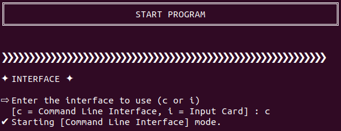
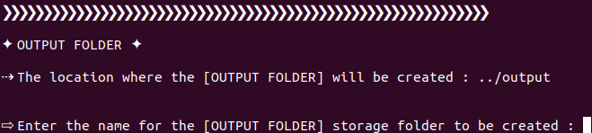
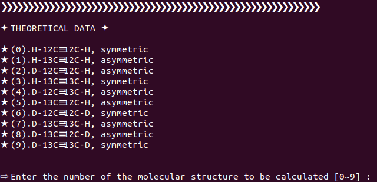
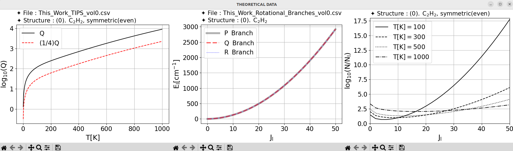
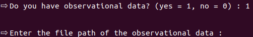
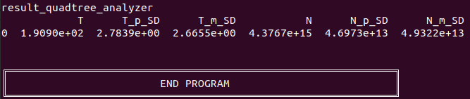

# Topsegi

Topsegi is a Python package developed to calculate the temperature (T) and column density (N) of molecules and their isotopologues observed in interstellar environments, such as planetary atmospheres, satellites, comets, carbon-rich stars, and the Orion IRc2 region. This package utilizes high-resolution infrared spectral data from instruments like SOFIA to accurately analyze molecular properties. Unlike traditional rotational diagram methods, which calculate T and N separately, this study introduces a quadtree-based optimization algorithm to estimate both variables simultaneously. This approach improves accuracy while reducing computational costs. Additionally, Topsegi is designed to supplement rotational and vibrational constants of isotopologues not available in the HITRAN database using Density Functional Theory (B3LYP) calculations. This Python package will be a valuable tool for quantitative analysis of interstellar molecules and is expected to be widely used in future high-resolution spectroscopic studies.

Note : The currently available version is not the full release but a Code Release.

# 

# How to Use Command Line Interface Mode

## 1. Please download TOPSEGI.zip.

Please download TOPSEGI.zip.

## 2. Before using TOPSEGI on Ubuntu/Debian  
### 1-1. Please download the TOPSEGI.zip file from [https://github.com/BrownNo28/ISM].  
### 1-2. Use the following commands to install the required Python3 packages for TOPSEGI:  
        pip3 install numpy pandas scipy matplotlib
        sudo apt install python3-tk
### 1-3. Extract the TOPSEGI.zip file and navigate to the `program` directory inside `TOPSEGI`.  
### 1-4. Run the TOPSEGI program using the following command:  
        python3 main.py
### 1-5. When the program starts, enter `c` to run the Command Line Interface mode.

## 2. Running TOPSEGI
### 2-1. Create a directory to store the output files (`.csv` and `.pdf`).

### 2-2. Select the molecule to be studied (Currently, only acetylene and its isotopologues can be selected).

### 2-3. Obtain the theoretical results for the selected molecule (Close the plot window to proceed to the next process).

### 2-4-1. If there is no observational data, the program terminate.

### 2-4-2. If observational data is available, enter the path to the data.(An example observational dataset for TOPSEGI is located at `../input/observational_data`.)

## 3. Output files
### All output files are generated in `../output/`. For more details, refer to [https://arxiv.org/abs/2501.15824].
